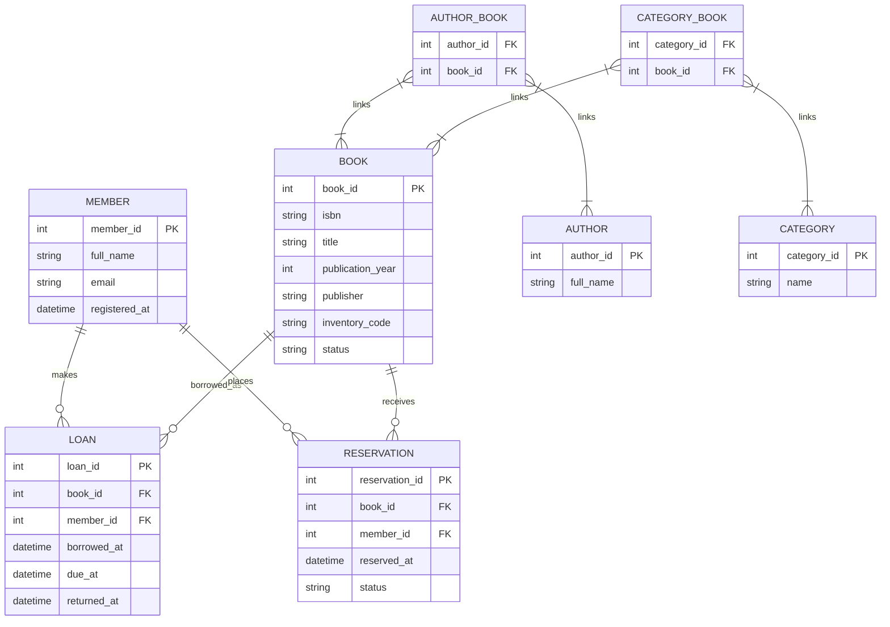

# Журнал взаємодії з AI (Prompt History)

## Ітерація 1: Вибір домену та початкова ER-модель бібліотеки

**Промпт:**
> "Потрібно виконати лабораторну роботу з моделювання даних. Обери домен міської бібліотеки та побудуй Mermaid ER-модель для читачів, авторів, книжок, категорій, видач і бронювань. Покажи сутності, атрибути, первинні й зовнішні ключі та кардинальності."

**Отриманий результат від AI:**

AI запропонував сутності `MEMBER`, `AUTHOR`, `BOOK`, `CATEGORY`, `LOAN` і `RESERVATION`, а також зв'язки між ними. У початковому варіанті фізичний примірник книжки ще не був виділений окремо: дані про інвентар і стан зберігалися в `BOOK`.

---

## Ітерація 2: Уточнення специфікації та критеріїв прийняття

**Промпт:**
> "Перевір початкову модель бібліотеки як інженер. Потрібно описати сутності та атрибути словами, додати критерії прийняття, перевірити типи ключів, кардинальності та нормалізацію до 3NF. Чисті M:N-зв'язки не перетворюй на асоціативні сутності."

**Отриманий результат від AI:**

Було створено специфікацію `spec.md`. Під час перевірки зафіксовано, що всі ідентифікатори мають мати однаковий тип `string`, а фізичний примірник потрібно відділити від бібліографічного опису книжки.

Також у специфікації уточнено:

- `BOOK` описує видання, а не конкретний екземпляр у фонді;
- `BOOK_COPY` має власний `copy_id`, інвентарний код і статус;
- `LOAN` пов'язаний із конкретним `BOOK_COPY`;
- один примірник може мати багато історичних видач, але не більше однієї активної;
- зв'язки `AUTHOR-BOOK` і `CATEGORY-BOOK` є чистими M:N;
- ER-модель не повинна містити фізичну схему БД або зайві сполучні сутності.

---

## Ітерація 3: Аудит і виправлення розбіжностей

**Зауваження та критика початкової моделі:**

1. **Неузгоджені типи ідентифікаторів:** у початковій діаграмі частина PK/FK була описана як `int`, хоча в критеріях потрібно було зафіксувати єдиний тип. Це могло призвести до різних типів у первинних і зовнішніх ключах.
2. **BOOK змішував різні поняття:** бібліографічний опис книжки одночасно містив інвентарний код і статус фізичного примірника. Через це модель не підтримувала кілька примірників однієї книжки з різними станами.
3. **Зайві сполучні сутності:** `AUTHOR_BOOK` і `CATEGORY_BOOK` були показані як окремі таблиці, хоча ці зв'язки не мали власних атрибутів. Для цієї ER-моделі достатньо прямого M:N-зв'язку.

**Коригувальні промпти:**

> "Приведи всі PK і FK до типу `string` та зафіксуй це окремим критерієм прийняття в `spec.md`. Назви полів у специфікації та Mermaid мають збігатися."

> "Розділи бібліографічну сутність `BOOK` і фізичний примірник `BOOK_COPY`. Перенеси інвентарний код, статус і дату надходження до `BOOK_COPY`, а `LOAN` пов'яжи з `copy_id`."

> "Прибери `AUTHOR_BOOK` і `CATEGORY_BOOK` як сполучні сутності. Заміни їх прямими чистими M:N-зв'язками, оскільки зв'язки не мають власних атрибутів."

**Фінальний результат:**

У фінальній моделі залишено сім сутностей: `MEMBER`, `AUTHOR`, `BOOK`, `CATEGORY`, `BOOK_COPY`, `LOAN` і `RESERVATION`. Для кожної сутності визначено PK типу `string`, а всі FK узгоджено з відповідними PK. Модель нормалізовано до 3NF, а Mermaid-опис використано для генерації `er-model.svg`.

---

## Ітерація 4: Фінальна перевірка

**Промпт:**
> "Проведи фінальний аудит відповідності `spec.md` та `er-model.mmd`: звір сутності, атрибути, ключі, типи, кардинальності, M:N-зв'язки та відповідність SVG-рендера джерельній Mermaid-моделі."

**Результат перевірки:**

- у моделі сім сутностей, описаних у специфікації;
- `BOOK-BOOK_COPY`, `MEMBER-LOAN`, `BOOK_COPY-LOAN`, `MEMBER-RESERVATION` і `BOOK-RESERVATION` мають правильні зв'язки 1:N;
- `AUTHOR-BOOK` і `CATEGORY-BOOK` залишилися чистими M:N;
- PK і FK мають узгоджений тип `string`;
- фізична схема БД, SQL DDL та ORM навмисно не створювалися;
- `er-model.svg` згенеровано з `er-model.mmd`;
- результати перевірки зафіксовано в `AUDIT.md`.
